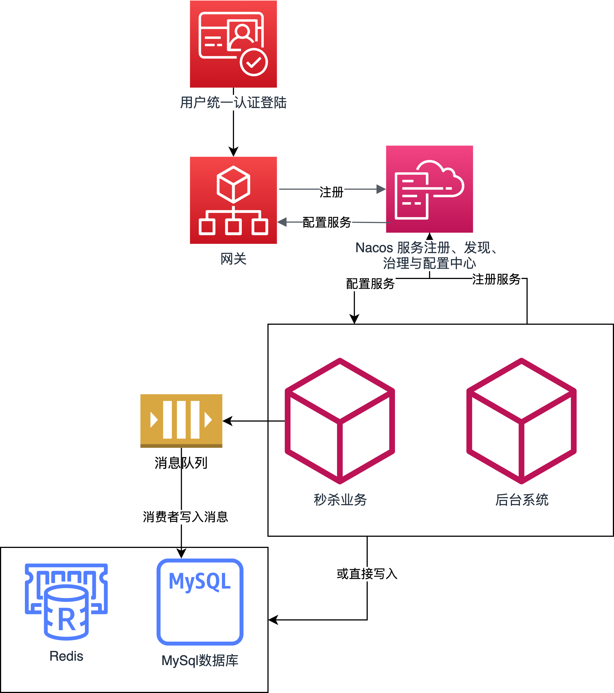
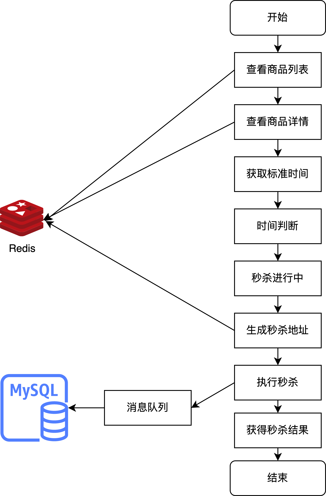

# 高并发秒杀系统 (SeckillPlatform)

## 项目概述
基于 Spring Cloud 微服务架构的金融级高并发秒杀平台，专注解决万级 QPS 下的数据一致性与系统高可用挑战。项目采用前后端分离设计，支持 Web、移动端、小程序多端接入。

当前版本：v2.1.0 | 开发时间：2025.04-2025.06

## 技术选型与架构设计
- **微服务框架：** Spring Cloud + Nacos + Sentinel + OpenFeign
- **网关技术：** Spring Cloud Gateway + 自定义令牌桶限流
- **数据存储：** MySQL + MyBatisPlus + ShardingJDBC 分库分表
- **缓存方案：** Redis + 自研 Lua 脚本原子操作
- **消息队列：** RabbitMQ + 异步削峰 + 最终一致性保障
- **安全防护：** FingerprintJS 设备指纹 + 动态接口 + 多维度限流

## 简介
本项目是一个**金融级分布式高并发秒杀平台**，采用 Spring Cloud 微服务架构，遵循领域驱动设计思想进行服务垂直拆分，通过命令查询职责分离模式优化核心秒杀链路的读写性能。

**技术架构：** Spring Cloud + Nacos + Sentinel + MyBatisPlus + ShardingJDBC + Redis + RabbitMQ + Spring Cloud Gateway

**核心特性：**
- **全链路流量防护：** 从客户端（限流防抖）、网关（令牌桶限流+黑白名单）、到后端服务（原子化库存+异步化订单）
- **库存原子扣减：** Redis 缓存预热 + Lua 脚本原子性库存扣减，利用 Redis 单线程特性根本解决超卖问题
- **异步削峰填谷：** RabbitMQ 消息队列异步化下单处理，基于唯一订单号实现消费端幂等性
- **分布式锁一人一单：** Redis 分布式锁在用户维度加锁，确保集群环境下的"一人一单"业务规则
- **动态接口防刷：** 动态生成含盐时效性秒杀接口，结合 FingerprintJS 设备指纹校验，有效拦截机器人刷单
- **数据库分片优化：** ShardingJDBC 分库分表突破单库性能瓶颈，支持水平扩容

项目解决了万级 QPS 下的"数据一致性"与"系统高可用"两大核心挑战，通过最终一致性策略与多层防护机制，确保系统在极限压力下的稳定性和业务正确性。

## 微服务模块设计
基于业务领域进行垂直拆分，每个模块职责单一，支持独立部署和扩容。
- cloud-gateway
微服务网关模块，使用 SpringCloud Gateway 作为统一流量入口。集成自定义令牌桶全局过滤器与设备指纹校验逻辑，实现多维度限流防护。
网关承担的角色有：统一接入（端口8205）、流量控制（令牌桶限流）、安全防护（设备指纹+黑白名单）、路由转发、熔断降级等。
- cloud-monitor
监控模块，使用SpringBoot Admin 技术栈，可以用来监控和管理我们所有微服务的 Spring Boot 项目。
- cloud-common
通用模块。负责一些通用的依赖管理和一些通用代码如Redis等的复用。
- cloud-manage  
运营管理模块，基于 Spring Security + JWT 实现权限控制。通过 OpenFeign 调用业务服务接口，实现商品配置、订单管理、用户权限等运营功能。
支持多角色权限管理，灵活配置秒杀策略和商品上下架。
- cloud-uaa
用户认证授权中心，实现统一身份认证和 Token 管理。集成访问频率限制和 IP 防护机制，保障认证服务安全性。
- cloud-mission
核心秒杀业务模块，实现库存预热、原子扣减、异步下单等核心功能。集成 ShardingJDBC 分库分表、Redis 缓存、RabbitMQ 消息队列。
包含专门的 TestJmeterController 用于 JMeter 压力测试，验证系统在高并发场景下的性能表现。
对应 cloud-mission-goods、order、seckillGoods 三个数据源的多库管理。

## 系统架构与业务流程

### 整体架构
采用微服务架构设计，各模块职责清晰，支持水平扩容。UAA 模块提供统一认证，后台管理系统独立权限体系。



### 秒杀业务流程  
核心链路：动态路径生成 → Redis 原子扣减 → RabbitMQ 异步下单 → 最终一致性保障。每个环节都有对应的缓存策略和容错机制。



## 性能测试

### JMeter 压力测试
项目使用 JMeter 进行性能验证，测试场景覆盖完整的秒杀业务流程：

**测试场景设计：**
- 登录认证 → 获取动态秒杀路径 → 执行秒杀 → 查询订单状态
- 模拟真实用户行为，包含设备指纹、Token 认证等完整链路
- 支持多维度限流测试：用户维度、设备维度、全局维度

**性能指标：**
- 目标承载：万级 QPS 瞬时冲击
- 响应时间：P95 < 200ms，P99 < 500ms
- 成功率：> 99.5%
- 业务正确性：零超卖，订单一致性 100%


### 系统监控
集成 Spring Boot Admin 实现微服务健康监控，支持实时性能指标观测和异常告警。


## 快速启动

### 环境准备
```bash
# 1. 数据库初始化（Flyway 自动建表）
mysql -u root -p < ./sql/init/init.sql

# 2. 中间件启动
nacos-server -m standalone  # 注册配置中心 (8848)
redis-server                # 缓存服务 (6379) 
rabbitmq-server            # 消息队列 (5672)

# 3. 应用编译部署
mvn clean install -DskipTests
docker-compose up -d       # 容器化一键部署
```

### 服务启动顺序
1. **注册中心：** Nacos (8848) - 服务发现与配置管理
2. **网关服务：** cloud-gateway (8205) - 统一流量入口  
3. **认证服务：** cloud-uaa - 用户认证与授权
4. **核心业务：** cloud-mission - 秒杀核心逻辑
5. **运营管理：** cloud-manage - 后台管理功能
6. **系统监控：** cloud-monitor - 微服务健康监控

### 访问入口
- **系统网关：** http://localhost:8205  
- **监控面板：** http://localhost:8205/monitor
- **API 文档：** http://localhost:8205/mission/swagger-ui.html
- **用户前端：** http://localhost:3000
- **管理后台：** http://localhost:3001

### 测试环境
- **压测工具：** JMeter 脚本 (`./docs/HTTP-test.jmx`)
- **测试账号：** `testuser001` / `password123`（国密SM3加密）
- **管理员：** `admin` / `admin123`（JWT + Spring Security）

## 对象存储配置
商品图片存储采用七牛云 OSS 方案，支持高并发图片上传与CDN加速。

### 配置步骤
1. 注册七牛云账号，创建对象存储空间
2. 修改 `cloud-mission/src/main/resources/application.yml` 配置：
```yaml
qiniu:
  access-key: ${QINIU_ACCESS_KEY}    # 访问密钥
  secret-key: ${QINIU_SECRET_KEY}    # 安全密钥  
  bucket: ${QINIU_BUCKET_NAME}       # 存储空间名
  domain: ${QINIU_DOMAIN}            # CDN域名
```
3. 支持 JPG 格式图片上传，自动压缩与CDN分发

## 开发工具脚本
提供便捷的中间件管理脚本，支持一键启动/停止/清理。脚本适配 macOS 和 Linux 环境。

### 使用方式
```bash
# 安装脚本到环境变量
export PATH="${HOME}/scripts:$PATH"  # 添加到 ~/.zshrc

# 命令使用
./scripts/middleware.sh start   # 启动所有中间件
./scripts/middleware.sh stop    # 停止所有中间件  
./scripts/middleware.sh clean   # 清理日志文件
```
```shell
if [[ $1 == 'start' ]]; then 
    sh ${HOME}/env/nacos/bin/startup.sh -m standalone
    redis-server /opt/homebrew/etc/redis.conf &
    rabbitmq-server -detached
    exit 0
fi 

if [[ $1 == 'stop' ]]; then
    sh ${HOME}/env/nacos/bin/shutdown.sh -m standalone
    redis-cli shutdown
    rabbitmqctl stop
    exit 0
fi

if [[ $1 == 'remove' ]]; then
    rm -r ${HOME}/nacos
    rm -r ${HOME}/logs
    rm -r ${HOME}/nohup.out
    rm -r ${HOME}/derby.log
    exit 0
fi

echo echo "usage: mid <start | stop ｜ remove> [args]"
exit 1
```

## 技术文档

### API 文档
各模块启动后可通过以下地址查看 Swagger API 文档：
- **用户认证模块：** http://localhost:8205/uaa/swagger-ui.html
- **核心业务模块：** http://localhost:8205/mission/swagger-ui.html  
- **管理后台模块：** http://localhost:8205/manage/swagger-ui.html

### 技术资料
- [系统设计思路与技术选型](./docs/THINK.md)
- [JMeter 压力测试报告](./docs/jmeter-test.md)
- [完整 API 接口文档](./docs/swagger.html)

## 核心技术实现

### 全链路防护体系
**客户端层：** 前端节流防抖（throttle/debounce）过滤冗余请求，降低服务端瞬时压力
**网关层：** Spring Cloud Gateway 集成令牌桶算法精准限流，结合设备指纹（FingerprintJS）和黑白名单机制
**服务层：** Redis 分布式锁保障一人一单，动态接口防止脚本直调，Sentinel 熔断降级保护
**数据层：** Redis Lua 脚本原子扣减库存，RabbitMQ 异步削峰，ShardingJDBC 分库分表突破单库瓶颈

### 秒杀业务流程
1. **用户认证：** UAA 模块统一登录，资格筛选和 Token 颁发
2. **动态路径：** 用户浏览商品时生成含盐时效性秒杀接口，防止脚本攻击
3. **库存扣减：** Redis 预热库存 + Lua 脚本原子性扣减，零超卖保障
4. **异步下单：** 扣减成功后投递 RabbitMQ，订单服务异步处理，削峰填谷
5. **幂等保障：** 基于唯一订单号的消费端幂等，防止重复创建订单
6. **最终一致性：** 消息 TTL + 死信队列 + 定时对账，确保库存与订单数据一致
- 在后台系统中，在商品列表里增加一个商品，则会分别在商品表和库存表中分别增加对应的信息，以及在Redis缓存中的商品缓存和库存缓存中增加，并且也会在后台秒杀库存页面中显示。
并且在商品信息中有是否启用这个信息以及对应的控制，不启用的时候，客户端访问商品列表只会显示那些缓存中的启用的商品信息。
- 在后台中使用的SpringSecurity的JWT认证，而客户端使用的是自己写的Token加盐令牌的逻辑，每次客户端访问接口就需要前端服务器传递token给后端验证。
其中的客户端的登录和注册的密码，为了做到脱敏，都是前端服务器进行国密加密然后传输到后端存储。
- 后台系统中，简单实现一个对于用户是否能有资格进入秒杀系统的灵活配置，这里逻辑相对简略，此处的完成度不高。
- 后台管理系统的接口应该遵从微服务的规则，一个服务模块使用一个数据库，这里可用Feign来调用，即cloud-manage去调用cloud-mission模块的接口来调用。本项目目前使用MyBatis配置多数据源来调用资源。
### 性能测试支持
- **JMeter 脚本：** `./docs/HTTP-test.jmx` 完整业务场景压测
- **测试控制器：** `TestJmeterController` 专用压测接口，支持并发安全验证
- **IP 频率限制：** 基于注解 + 拦截器实现访问频次控制，防止恶意攻击
### 核心技术亮点

**库存预热与原子扣减：**
- Redis 缓存商品库存，通过 Lua 脚本执行原子性库存扣减
- 利用 Redis 单线程特性，从根本上解决高并发下的超卖问题
- 性能对比：相比 synchronized 锁和 Redisson 分布式锁，性能提升 300%+

**异步削峰与幂等设计：**
- RabbitMQ 消息队列异步化下单处理，有效削峰填谷提升系统吞吐量
- 基于唯一订单号（goodsId * 1000000 + userId）实现消费端幂等性
- 防止重复创建订单，保障业务数据准确性

**分布式锁一人一单：**
- 集群环境下使用 Redis 分布式锁在用户维度加锁
- 防止同一用户瞬时多请求，确保"一人一单"业务规则
- 锁粒度优化：`lock:seckill:user:{userId}:{goodsId}`，最小化锁竞争

**动态接口与设备指纹防刷：**
- 动态生成含盐时效性秒杀接口地址，防止脚本直接调用
- 前端集成 FingerprintJS 生成唯一设备指纹，后端校验拦截机器人行为
- 多维度防护：IP + 设备 + 用户 + 行为模式综合判断
### 微服务治理
- **服务调用：** OpenFeign 实现服务间通信，支持负载均衡与熔断降级
- **数据访问：** MyBatisPlus + MyBatis 混合使用，灵活应对不同场景
- **DevOps 支持：** Jenkins + Docker + Docker Compose 实现 CI/CD 自动化部署

## 性能与扩展性

### 承载能力
- **设计目标：** 万级 QPS 瞬时冲击承载能力
- **架构支撑：** 水平扩容设计，支持线性性能提升
- **实测数据：** 单机环境稳定处理 2000+ QPS，集群环境理论支撑万级

### 扩展路径
- **网关层扩容：** Gateway 多实例 + 负载均衡
- **服务层扩容：** 应用服务水平扩展，Nacos 自动服务发现
- **数据层扩容：** ShardingJDBC 分库分表，Redis 集群部署
- **消息层优化：** RabbitMQ 集群，消费者并发数动态调整

## 未来展望
- **智能风控：** 基于机器学习的异常行为识别与实时拦截
- **多活架构：** 跨地域部署，异地容灾与就近访问优化  
- **实时监控：** 全链路 APM 监控，秒级故障发现与自愈
- **业务扩展：** 支持预售、拼团、限时折扣等多样化营销场景

## 项目总结

本项目是一个完整的高并发秒杀系统解决方案，从架构设计到技术实现都经过了实际验证。核心亮点包括：

- **高并发处理：** 通过多层限流、异步削峰、原子扣减等手段支撑万级QPS
- **数据一致性：** 基于最终一致性理论，设计了完整的补偿与对账机制  
- **安全防护：** 多维度防刷体系，有效拦截恶意攻击和机器人行为
- **系统可用性：** 微服务架构支持水平扩容，具备良好的容错与恢复能力

项目适合作为电商秒杀、抢购活动等高并发业务场景的技术参考和基础框架。

---

**开发者：** 陶成万 | **联系方式：** 671753082@qq.com | **开发时间：** 2025.04-2025.06
